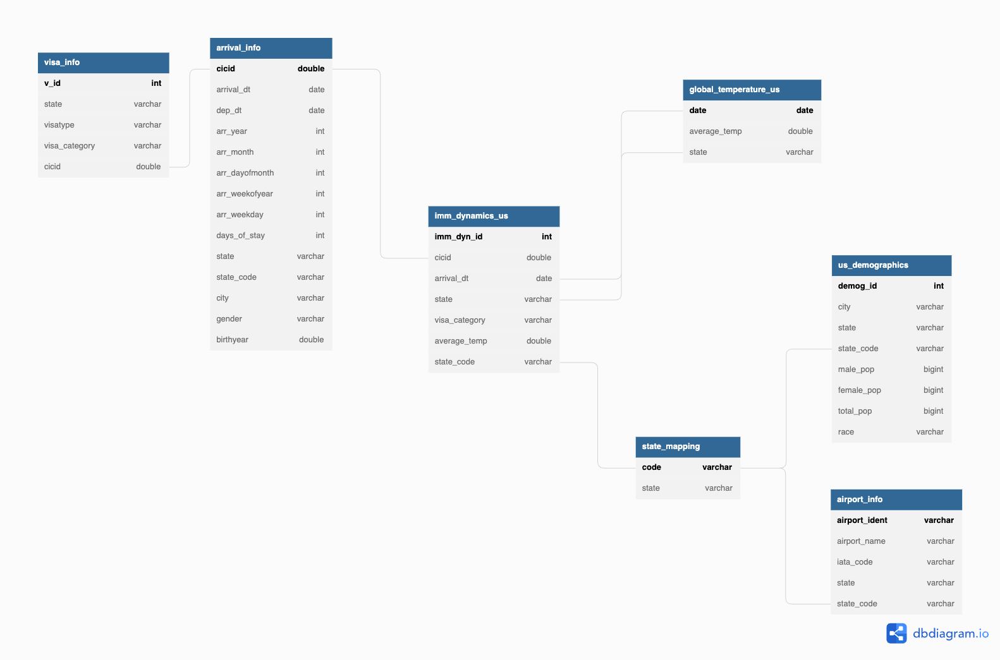

# Data Engineering Capstone Project

## Project Description
A statistical institute collect information regarding the immigration data information of United States where the people arrival information, their visa status, demographic information is recorded. The institute also wishes to collect some other interesting information for their analysis such as temperature information during the period of time, population dynamics, airport information. The statistical team has little experience with utiliziing multiple data sources and looking for a data engineer who can build them a PoC to engineer the data models. If successful in future they look to build dashboards on top this information.

## Dataset Utilised
For the project, below dataset is used:  
1. sas_data  
Description: The sas data contains the immigration information of the passenger spanned in the year of 2016.  

Column Information:  
Below are the important column level informations:  
| Column   | Description                                    | Data Type |
|----------|------------------------------------------------|-----------|
| cicid    | Unique identifier for the immigration data     | double    |
| i94yr    | year of arrival to us                          | double    |
| i94port  | Port Mapping for city                          | varchar   |
| i94mode  | Mode of arrival (Air, Sea, Land, Not reported) | int       |
| i94addr  | Code Mapping for State                         | varchar   |
| arrdate  | Arrival Date                                   | date      |
| depdate  | Departed Date (-9999 if not departed)          | date      |
| i94visa  | reason of visa (Business, pleasure, student)   | int       |
| biryear  | Date of birth                                  | date      |
| gender   | Non-immigrant sex                              | varchar   |
| visatype | Type of visa (B1 type etc...)                  | varchar   |

2. airport-codes_csv -  
Description: The airport information of USA is extracted.   
Column Information:  
Below are the important columns considered for the analysis.  

| Column     | Description                | Data Type |
|------------|----------------------------|-----------|
| ident      | airport identifier         | varchar   |
| type       | type of airport            | double    |
| iso_region | State Code in US           | varchar   |
| iata_code  | Reference Code for airport | varchar   |

3. city-mappings.csv  
Description:  A mapping file is created manually extracting information from the sas data for port information.  

4. State_mapping.csv - A mapping file is created manually for extracting information of the state by its code.  

5. GlobalTemperaturesByState.csv  

Description:  The global temperatures by state, country recorded. This is filtered for only to contain data of USA and there were Nulls in the time series for which a Median imputation is applied over broadcast udf.  

Column Information:   
Important column information are shown below:  
| Column             | Description                        | Data Type |
|--------------------|------------------------------------|-----------|
| dt                 | Date of recording                  | date      |
| AverageTemperature | The average temperature of the day | double    |
| State              | States (Filtered to US)            | varchar   |
| Country            | Country                            | varchar   |


6. us-cities-demographics.csv  

Description: The us demographics containing the population information, is shown.  

Column Information:  
Important column details are shown below  
| Column            | Description                     | Data Type |
|-------------------|---------------------------------|-----------|
| City              | The city in USA                 | varchar   |
| State             | The state in USA                | varchar   |
| male_population   | Male Population in the region   | bigint    |
| female_population | Female Population in the region | bigint    |
| total_population  | Total Population in the region  | bigint    |

## Prerequisites
- Apache Spark (Either installed locally or on AWS)
- configparser
- python3
- pip
- EMR Cluster (To submit spark job on AWS)
- Might need to create outputs folder on a new project.  
### The following approach is taken in the project:  
1. Ideation of the Project and Dataset used (We have seen this above)
2. Exploratory Data Analysis of the underlying data.
3. Defining the Data Model, Utilizing some of the ideas of synthetic dataset approach
4. Executing ETL to extract the dataset, remove nulls, perform some of the transformations, and load the transformed data into facts and dimensions in parquet
5. Complete Project Write Up


## Step 2: Exploratory Data Analysis  
For this process, at the very beginning an exploratory data analysis is done using pyspark, jupyternotebook to understand the underlying data, its description and types. Then for each of the datasets important column for creating the data model for identified. All the required transformations, data preparation to handle nulls, imputations, convertion of date from one format to another, extract time dimensional information were done. Finally, utiliying the data model fact and dimensional tables were created.  

Ref: [EDA Notebook](spark_tranform_exploration/Exploration_NB.ipynb)

## Step 3: Data Model Definition and approach
### 3.1 Data Model Design


As seen from the diagram the project aims in creating the following fact and dimensions for the PoC:  
Fact Table:  imm_dynamics_us  
This table helps in providing some of fact level information like the number of visa_category that arrived in USA, their arrival date ranges, the average_temp and using the state_code to further go deep into the dimensions to obtain information on the demographics and airport for the given state.  

Dimensions:  
- arrival_info:  The arrival_info table consist of the arrival information recorded by arrived immigrants. The visa information is nested into other dimension called visa_info containing their visa information mapped based on the cicid.  
- global_temperature_us: The table consist of the temperature recordings done in each of the states. The fact table is generated by joining the arrival_date with temperatures, and with state. (Note: The time span of this data is only upto 2013. So, a synthetic dataset is created and joined with the original data to extend the span to get the expected information)  
- state_mapping: This is the mapping information of the state_code and state itself. The state_code is then mapped into 1:M relation with the demographics_us data and airport_information as both of this data contain state and city level information.  

### 3.2 Data Pipelines Approached
The pipeline steps are as follows:  
1. Read and process immigration data utilizing state and city mapping. Perform cleaning, transformation of date information.  
2. Read and process us_demographics data, apply filtering, column renaming changing whitespaced column to underscore, perform cleaning on the city information.  
3. Read and process global_temperature_data, apply median imputation, clean.  
4. Utilize 1-3 steps clean dataframe to give create temporary views for applying spark sqls. Utilize it to create and ingest the data models and write them as parquet for efficient storage and queries.  
5. Apply data quality check at each steps for checking nulls, correction of data format and data model ingestion counts.    

### 4 Executing the ETL pipeline
```
spark-submit --packages saurfang:spark-sas7bdat:2.0.0-s_2.10 etl_spark.py 
```
The helper module contains the setup for udf functions.  

Ref: [ETL](etl_spark.py)

### Complete Project Write Up  
#### Data Updation Frequency  
- Immigration Data:
As understood from the span of the data, it should be updated in a monthly manner so that new informations are received into the data model.  
- Global Temperature Data:  
Since, our data model is looking to utilize to get temperature information, it is also better to get the information of the temperatures in daily manner.  
- Demographics Data:  
This information can be updated every 1 year as this is more of a lookup table for further related information about the state.  
- Airport Information:  
The airport information should be updated 2 years once since having a new airport would not be that frequent. However, it was observed that the airport information could not be mapped directly to immigration data. In the future, we should look to extract airport information into immigration data.  

All of the data should be incrementally appended so that there is historical information available.  

#### Considerations:  
- If the data is increased by 100x:  
For the project since spark is already utilized, it should be able to handle the incoming load. However, it should done in the cluster-mode and not in standalone-mode.  
- If the pipelines were run on daily basis by 7am.  
In such a scenario, airflow or AWS Glue with scheduled triggered could be utilized.  
- If the database needed to be accessed by 100+ people.  
Intially postgres database could be tested since it can also handle 100+ users. Parallely by benchmarking for some days, an estimate could be made based on the costs, and overhead of current setup and then a shift to Redshift can be good choice which is a Massive Parallel Processing cluster with features such as dist_key, sort_key and can handle user creations, authentication and access through user creation or role based in AWS.  

### Future Improvements:  
1. Building a dashboard on data model using streamlit or Quicksight.    
2. Understanding and implementing a serverless ETL pipeline on AWS.  